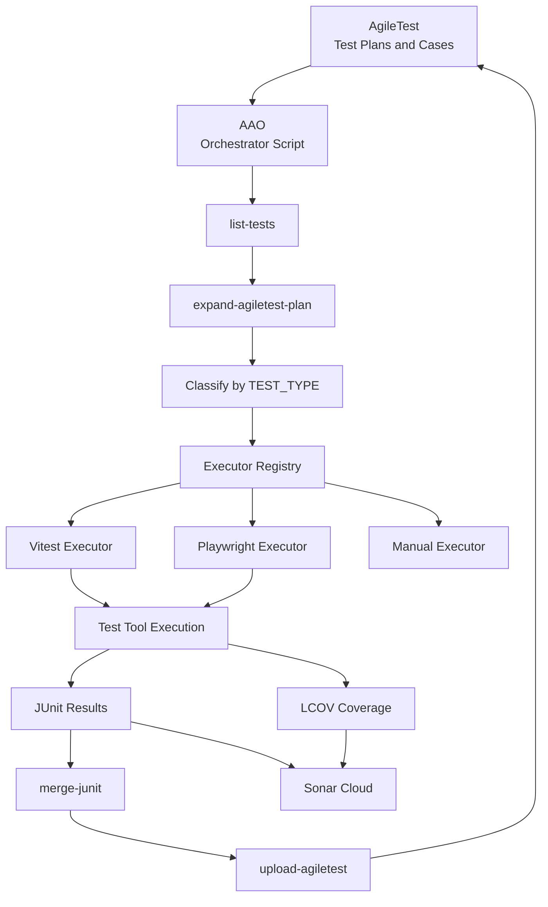

# AgileTest Automation Orchestrator (AAO)


> A thin orchestration layer between AgileTest and your automated test tooling (by default Playwright, Vitest, and Sonar Cloud).

---

## Why AAO exists

Whilst AgileTest provides great support for managing the test effort within Jira, it does not yet have great support for managing execution of automated testing via external tools as it does not maintain any relationship between its test cases and automation test scripts. AgileTest documentation references an *Orchestrator Script* pattern to address this problem, but provides no concrete implementation.

**AgileTest Automation Orchestrator (AAO) exists to fill that gap.**

It is a lightweight orchestration layer that:

- Treats AgileTest as the system of record
- Maps AgileTest Test Plans to their associated Test Cases and those Test Cases to external automation scripts
- Calls the appropriate test execution tools to execute those automation scripts
- Uploads results and coverage to downstream systems
- Does this without becoming a test runner itself

---

## What AAO is (and is not)

### AAO is

- An automated test orchestration tool
- A concrete implementation of the AgileTest Orchestrator Script pattern
- Framework-agnostic (shipping with Executors for Playwright and Vitest)
- Consumer-aware (shipping with Sonar Cloud integration)
- Package-manager-agnostic (pnpm by default)
- Designed to be extended through configuration, not forks

### AAO is not

- A test runner
- A replacement for Playwright, Vitest, Jest, Cypress, etc.
- A CI system
- A test management system

---

## Core concepts: Producers, Executors, Consumers

AAO revolves around three key concepts and three explicit interfaces.

### Producers

Producers create lists of Test Cases to execute. The Test Case interface is a space-separated string of Jira TestCase keys.

- **AgileTest Producer**: Test Plans → Test Cases
- **Repository Index Producer**: repository scan → automation scripts + header metadata

### Executors

Executors run automation scripts. Executors are selected via `TEST_TYPE` in the automation script header. The automation script interface is a set of files located under the configured test root.

Built-in Executors:

- `vitest`
- `playwright`
- `manual`

### Consumers

Consumers ingest outputs from Executors. AAO produces two primary output interfaces: **JUnit** and **LCOV**.

Built-in Consumers:

- **AgileTest** (JUnit)
- **Sonar Cloud** (JUnit + LCOV)

---

## High-level architecture



---

## How it works

1. **Index tests**  
   Automation scripts are scanned and fixed-format headers associate scripts with AgileTest Test Case IDs and an Executor type.

2. **Expand Test Plans**  
   AgileTest Test Plans are resolved into concrete test files.

3. **Classify tests**  
   Files are assigned to Executors based on `TEST_TYPE` (preferred) and optional filename matching rules (fallback).

4. **Execute automation**  
   Each Executor builds an execution plan and invokes the tool using command templates. pnpm is the default, but not required.

5. **Merge and publish outputs**  
   JUnit outputs are merged and uploaded to both AgileTest and Sonar. LCOV outputs are ingested by Sonar.

---

## Install / Build (monorepo workspace)

```bash
pnpm -w --filter @aao install
pnpm -w --filter @aao build
```

---

## Run

AAO can be executed either via the workspace package manager (recommended) or directly via Node.js.

### Recommended: workspace invocation

```bash
pnpm -w exec aao --test-plan-keys "KEY-12 KEY-34"
```

This runs AAO inside the workspace context, ensuring:

- correct dependency resolution
- consistent tooling (pnpm, vitest, playwright)
- parity with CI execution

### Node.js invocation

AAO also supports direct execution via Node.js. This is useful for scripting and debugging outside pnpm wrappers.

#### Requirements

When invoking AAO via `node`, the following conditions must be met:

- `AAO_PROJECT_ROOT` **must be set**
  - This must point to the repository root
  - The repository root is expected to contain `pnpm-workspace.yaml`

- `pnpm` must be available on `PATH`
  - Executors are invoked via pnpm

If any of these conditions are not satisfied, AAO will fail fast with a descriptive error.

#### Example

```bash
export AAO_PROJECT_ROOT="/path/to/swimometer_app"

node packages/agiletest-automation-orchestrator/dist/cli.js \
  --test-plan-keys "KEY-12 KEY-34"
```

---

## Supported CLI arguments

### `test-plan-keys`

| Option | Required | Description |
| ------ | -------- | ----------- |
| `--test-plan-keys` | No | Space-separated list of AgileTest Test Plan keys to expand and execute |

If `--test-plan-keys` is provided, AAO sets `AAO_AGILETEST_TEST_PLAN_KEYS` for this run, then expands those plans and executes only matching automation scripts.

If neither `--test-plan-keys` nor `AAO_AGILETEST_TEST_PLAN_KEYS` nor `producers.agiletest.test-plan-keys` is set, AAO executes all automation scripts discovered under `project.test-root`.

---

## Configuration model

AAO is configured using a layered configuration model with a single canonical source of truth: a structured JSON configuration file.

All configuration values belong to a well-defined JSON hierarchy. Environment variables and command-line flags (--test-plan-keys) exist only to override values defined in this hierarchy.

### Canonical configuration source

The canonical configuration is expressed as JSON with four top-level sections:

- `project` – repository layout and execution context
- `producers` – sources of Test Cases (AgileTest, Jira, repository index)
- `executors` – tools that execute automation scripts
- `consumers` – systems that consume results (AgileTest, Sonar)

AAO ships with an `aao.defaults.json` file that defines sensible defaults and example integrations. The aao.defaults.json is expected to be found in the package root. It serves both as:

- the default runtime configuration
- and the authoritative reference for supported configuration keys

Teams are encouraged to edit this file to define their toolchain. It is not recommended that access credentials to those tools be declared here.

### Configuration precedence

Configuration values are resolved in the following order, from lowest to highest precedence:

1. Defaults file (`aao.defaults.json`)
2. Environment variables (`AAO_*`)
3. Command-line flags (--test-plan-keys, which overrides AAO_AGILETEST_TEST_PLAN_KEYS/producers.agiletest.test-plan-keys property)

Later layers override earlier layers on a per-property basis.

If a value is required and is missing after all layers are applied, AAO will fail fast with a descriptive error.

### JSON to environment variable mapping

Every configuration value can be overridden using an environment variable derived mechanically from its JSON path.

#### Mapping rules

- Strip the top-level object name (`project`, `producers`, `executors`, `consumers`)
- Join remaining path segments with `_`
- Convert to upper case
- Prefix with `AAO_`

Examples:

- `project.test-root` → `AAO_TEST_ROOT`
- `project.results-dir` → `AAO_RESULTS_DIR`
- `executors.vitest.cmd` → `AAO_VITEST_CMD`
- `consumers.sonar.host-url` → `AAO_SONAR_HOST_URL`
- `producers.agiletest.project-id` → `AAO_AGILETEST_PROJECT_ID`

This mapping is deterministic and requires no explicit registry in code.

Similarly Scalar substitution tokens within the aao.defaults.json file (see sonar.cmd as an example) are mapped as follows;

- Strip the top-level object name (`project`, `producers`, `executors`, `consumers`)
- Join remaining path segments with `-`
- Maintain lower case.
- No prefix

Examples:

- `project.test-root` → `{test-root}`
- `project.results-dir` → `{results-dir}`
- `consumers.sonar.host-url` → `{sonar-host-url}`
- `producers.agiletest.project-id` → `{agiletest-project-id}`

### Shipped configuration reference

#### Project configuration

| JSON path | Required | Description | Recommended source |
| ------- | -------- | ----------- | ------------------ |
| `project.defaults-root` | No | absolute or relative path to the aao.defaults.json file, if not specified will default to the AAO package root. Note this is only actionable if overridden by AAO_DEFAULTS_ROOT | env |
| `project.project-root` | Yes | Repository root directory | aao.defaults.json |
| `project.test-root` | Yes | Root directory containing automation scripts | aao.defaults.json |
| `project.results-dir` | Yes | Directory for JUnit outputs | aao.defaults.json |
| `project.coverage-dir` | Yes | Directory for coverage outputs | aao.defaults.json |

#### Producer: AgileTest

| JSON path | Required | Description | Recommended source |
| ------- | -------- | ----------- | ------------------ |
| `producers.agiletest.submit-base-url` | Yes | AgileTest API base URL | aao.defaults.json |
| `producers.agiletest.auth-base-url` | Yes | AgileTest API base URL for obtaining JWT authorization tokens | aao.defaults.json |
| `producers.agiletest.project-id` | Yes | AgileTest internal project ID | env |
| `producers.agiletest.client-id` | Yes | OAuth client ID | env |
| `producers.agiletest.client-secret` | Yes | OAuth client secret | env |
| `producers.agiletest.timezone` | Yes | Timezone for API calls | aao.defaults.json |
| `producers.agiletest.test-plan-keys` | No | Test Plans to execute | CLI / env |

#### Producer: Jira

| JSON path | Required | Description | Recommended source |
| ------- | -------- | ----------- | ------------------ |
| `producers.jira.base-url` | Yes | Jira base URL | env |
| `producers.jira.email` | Yes | Jira account email | env |
| `producers.jira.api-token` | Yes | Jira API token | env |

#### Executors: Playwright, Vitest

| JSON path | Required | Description |
| ------- | -------- | ----------- |
| `executors.<type>.match` | No | Regex to identify automation scripts |
| `executors.<type>.cmd` | Yes (except manual) | Command template |

#### Consumers: Sonar

| JSON path | Required | Description |
| ------- | -------- | ----------- |
| `consumers.sonar.enabled` | No | Enables Sonar publishing |
| `consumers.sonar.host-url` | Required if enabled | Sonar host URL |
| `consumers.sonar.project-key` | Required if enabled | Sonar project key |
| `consumers.sonar.org` | Optional | SonarCloud organization |
| `consumers.sonar.token` | Required if enabled | Sonar authentication token |

If consumers.sonar.enabled is omitted or set to false, the Sonar Consumer is not invoked.
In this case:

- All other Sonar configuration values are optional
- Missing Sonar values will not trigger validation errors

If consumers.sonar.enabled is true, required Sonar fields must be present and valid.

### Command template expansion

AAO command templates support two kinds of placeholders:

#### Scalar substitution

Tokens such as `{project-root}`, `{test-root}`, and `{coverage-dir}` are replaced
with their resolved configuration values via simple string substitution.

#### File list substitution: `{files}` (Executors)

For Executors, AAO builds a deterministic list of test files to run, then substitutes `{files}` with that list.

**Contract:**

- `{files}` expands to a space-separated list of file paths.
- Each path is quoted.
- Paths are absolute (fully qualified).
- Ordering is deterministic (AAO sorts the list).

This makes Executor templates predictable and portable:

```json
{
  "executors": {
    "vitest": {
      "cmd": "pnpm -C {project-root}/apps/web exec vitest --run {files}"
    },
    "playwright": {
      "cmd": "pnpm -C {project-root}/apps/web exec playwright test {files}"
    }
  }
}
```

#### Filesystem expansion (recursive)

AAO supports explicit filesystem-driven expansion using the form:

`{expand:<base>|<match>|<separator>}`

Expansion semantics:

1. `<base>` is resolved to an absolute directory path
2. AAO recursively scans `<base>` (including all subdirectories)
3. The `<match>` regular expression is applied to each file’s path relative to `<base>`
4. Matching files are converted to absolute paths
5. Paths are sorted deterministically
6. Paths are joined using `<separator>`

Expansion always emits fully qualified paths. AAO does not rely on shell globbing
or working-directory assumptions.

#### Environment variable injection (`env`)

Any configuration object that defines a `cmd` may also define an optional `env` object.

The `env` object is a map of environment variable names to template values. Each value
supports the same scalar substitution rules as `cmd`.

Example:

```json
{
  "consumers": {
    "sonar": {
      "cmd": "sonar-scanner ...",
      "env": {
        "SONAR_TOKEN": "{sonar-token}"
      }
    }
  }
}
```

Behavior:

- Environment variables are injected directly via process spawning
- AAO does not rely on shell-specific syntax (e.g. VAR=value cmd)
- Scalar substitution is applied before execution
- Environment variables from env override inherited process environment values

This mechanism is generic and applies to Executors and Consumers alike.

### AAO consolidation

AAO may perform consolidation via simple concatenation, when required by a downstream Consumer contract.

#### JUnit (test results)

The AgileTest Consumer requires a single JUnit XML document per execution.
For this reason, AAO consolidates all `*.xml` files discovered under
`project.results-dir` into:

- `junit-merged.xml`

This consolidated file is then uploaded to AgileTest.

#### LCOV (coverage)

The Sonar Consumer accepts multiple LCOV inputs.
Therefore, AAO does **not** consolidate coverage.

All LCOV files discovered under `project.coverage-dir` are passed directly
to Sonar via filesystem expansion.

### Behavior on omission

- Missing required Producer configuration causes a hard error.
- Missing Executor configuration causes a hard error if referenced by an automation script.
- Disabled Consumers are skipped entirely.
- Coverage is published only if produced and a Consumer accepts it.

## Aligning AAO and external tools

AAO defines two primary output interfaces:

- **JUnit XML** (test results)
- **LCOV** (coverage)

### Output directories

- JUnit outputs must be written under `project.results-dir`
- Coverage outputs must be written under `project.coverage-dir`

### Output layout convention

When multiple tools write outputs of the same type (JUnit, LCOV, etc.), avoid collisions
by writing into tool-specific subdirectories under the shared output root.

Examples:

- JUnit: `project.results-dir/vitest/*.xml`, `project.results-dir/playwright/*.xml`
- Coverage: `project.coverage-dir/vitest/lcov.info`, `project.coverage-dir/playwright/lcov.info`

AAO relies on `{expand:...}` to discover files recursively, so tools do not need to rename
their default output filenames.

### Playwright installation and configuration

Playwright is configured via the playwright.config.ts file. It produces test results as JUnit XML. It should be set to specify the same results directory as set in project.results-dir.

NOTE: Playwright defines an **Artifacts outputDir** (used to store traces, attachments, etc.). If not set explicitly, Playwright assumes this is the same directory as the JUNIT XML. Playwright deletes `outputDir` on startup! **Do not set `outputDir` to the shared `project.results-dir`** or it will remove other executors’ results (for example Vitest’s JUnit file). Instead, set `outputDir` to a subdirectory inside the results directory.

For example playwright.config.ts;

```ts
export default defineConfig({
  outputDir: 'test-results/playwright',
  reporter: [
    ['junit', { outputFile: 'test-results/playwright-junit.xml' }],
  ]
})
```

### Vitest configuration

Vitest is configured via the vitest.config.ts file. It produces test results as JUnit XML and coverage as LCOV. It should be set to specify the same results directory as set in project.results-dir. It should also be set to specify the same coverage directory as set in project.coverage-dir.

For example vitest.config.ts;

```ts
export default defineConfig({
  test: {
    reporters: [
      "default",
      ["junit", {outputFile: "test-results/vitest-junit.xml",}],
    ],
   coverage: {
      reportsDirectory: "test-coverage/vitest",
    },
   }
})
```

### Sonar Configuration

Sonar is configured via the sonar-project.properties file. As shipped, AAO invokes `sonar-scanner` and provides LCOV inputs via a `-D` property. That is, AAO discovers all coverage files under `project.coverage-dir` using filesystem expansion and passes the resulting file list to Sonar:

- `-Dsonar.javascript.lcov.reportPaths=<comma-separated absolute paths>`

This overrides any setting of the sonar.javascript.lcov.reportPaths in the properties file.

If enabled, AAO will run Sonar with analysis even if test results and coverage information are missing.

---

## Automation script header contract

AAO defines and relies on the relationship between the AgileTest Test Case and the corresponding automation script. The relationship is declared in a fixed-format script header at the top of each automation script and each manual Markdown test file.

### Automation Script tags

| Field | Required | Purpose |
| --- | --- | --- |
| `AGILETEST_TICKET` | Yes | External identifier for the Test Case, typically a Jira key like `PROJ-123` |
| `TEST_TYPE` | Yes | Declares which Executor should run this script (`vitest`, `playwright`, `manual`, or a custom Executor type) |
| `TEST_TITLE` | Yes | Canonical title used by the runner and downstream reporting (JUnit, dashboards, Sonar) |
| `TC_ID` | No | AgileTest Test Case ID, if you distinguish IDs from Jira keys |
| `TC_DESC` | No | Short, human-readable description |
| `SUITES` | No | Tags for grouping and filtering, using `@tag` style |

### Why `TEST_TITLE` is required

`TEST_TITLE` is the stable string that survives across:

- runner output formatting
- JUnit generation
- CI dashboards
- long-term trend and correlation in tools like Sonar

Recommended construction:

```ts
export const TEST_TITLE = `${TC_ID} ${AGILETEST_TICKET} ${TC_DESC}`;
```

If you omit `TC_ID` and `TC_DESC`, keep it deterministic and include the ticket key:

```ts
export const TEST_TITLE = `${AGILETEST_TICKET} - anonymized behavior description`;
```

### Playwright boilerplate

```ts
/**
 * =====================================================================
 * TEST CASE:
 * ---------------------------------------------------------------------
 */
export const AGILETEST_TICKET = "PROJ-123";
export const TEST_TYPE        = "playwright";
export const TC_ID            = "TC-EX-E2E-001";
export const TC_DESC          = "Scenario description";
export const SUITES           = ["@e2e", "@web-e2e", "@regression"];
export const TEST_TITLE       = `${TC_ID} ${AGILETEST_TICKET} ${TC_DESC}`;
/**
 * =====================================================================
 */

import { test, expect } from "@playwright/test";

test(TEST_TITLE, async ({ page }) => {
  test.info().annotations.push(
    { type: "JIRA", description: AGILETEST_TICKET },
    { type: "SUITES", description: SUITES.join(" ") },
  );
  // ...
});
```

### Vitest boilerplate

```ts
/**
 * =====================================================================
 * TEST CASE:
 * ---------------------------------------------------------------------
 */
export const AGILETEST_TICKET = "PROJ-456";
export const TEST_TYPE        = "vitest";
export const TC_ID            = "TC-EX-UT-001";
export const TC_DESC          = "Scenario description";
export const SUITES           = ["@unit", "@web-unit", "@regression"];
export const TEST_TITLE       = `${TC_ID} ${AGILETEST_TICKET} ${TC_DESC}`;
/**
 * =====================================================================
 */

import { describe, it, expect } from "vitest";

describe(TEST_TITLE, () => {
  it("Expected behavior", () => {
    expect(true).toBe(true);
  });
});
```

---

### Manual test boilerplate (Markdown)

Manual tests are indexed and selectable, but not executed by AAO.

```md
<!--
 * =====================================================================
 * TEST CASE:
 * ---------------------------------------------------------------------
-->
AGILETEST_TICKET = PROJ-789
TEST_TYPE        = manual
TC_ID            = TC-EX-MAN-001
TC_DESC          = Scenario description
SUITES           = @manual @smoke
<!--
 * =====================================================================
-->
```

---

## Extending AAO

AAO is intentionally configuration-driven. Most teams can extend AAO without modifying code.

Adding a new Executor requires only:

- Defining a new TEST_TYPE in automation script headers
- Adding a corresponding entry under the executors section of the aao.defaults.json

Adding new Producers or Consumers requires code, as these introduce new external interfaces.

Detailed extension guides are provided in separate documentation.

---

## About Mermaid diagrams

This README uses Mermaid diagrams.

- They render automatically on GitHub
- They render in VS Code with a Mermaid preview extension
- They are plain text and safe to edit

---

## Project status

AAO is currently **experimental**.

The public API may evolve as:

- additional Executors and Consumers are added
- manual test workflows are expanded
- community feedback is incorporated

Contributions and feedback are welcome.

---

## License

This project is licensed under the MIT License.

See the MIT License:

- <https://opensource.org/licenses/MIT>
